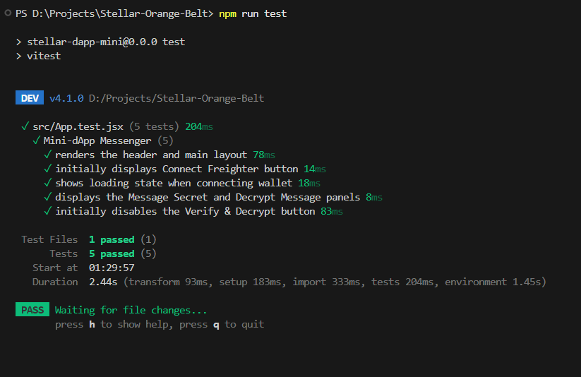

# SafeBoxMessage - End-to-End Encrypted Messenger 🔒

A secure, decentralised messaging application leveraging AES-256 for military-grade encryption and the Stellar (Soroban) Testnet for unforgeable timestamping and message existence proofs.

## 🌟 Live Demo & Video
- **Live Demo:** [https://steller-orange-belt.vercel.app/](#)
- **Demo Video:** [https://drive.google.com/file/d/11LNZ7mTTjJbnsj5eN9rLuvLF3J503DUE/view?usp=sharing](#)

---

## 📋 Deployed Contract

| Field | Value |
|-------|-------|
| **Network** | Stellar Testnet |
| **Contract Address** | `CCP4Z5BZG3VCWWGNIDRPFJK4CMFHXJDPKAGOVO4RF62QN7L4R7ZFJATM` |
| **View on Explorer** | [stellar.expert/explorer/testnet/contract/CCP4Z5BZG3VCWWGNIDRPFJK4CMFHXJDPKAGOVO4RF62QN7L4R7ZFJATM](https://stellar.expert/explorer/testnet/contract/CCP4Z5BZG3VCWWGNIDRPFJK4CMFHXJDPKAGOVO4RF62QN7L4R7ZFJATM) |

---

## 🔁 Contract Call Transaction

| Field | Value |
|-------|-------|
| **Transaction Hash** | `7e245c43fe767380230d5d5eee9eac19f6df5e7bb44b551bbae002f278f0edb2` |
| **View on Explorer** | [stellar.expert/explorer/testnet/tx/7e245c43fe767380230d5d5eee9eac19f6df5e7bb44b551bbae002f278f0edb2](https://stellar.expert/explorer/testnet/tx/7e245c43fe767380230d5d5eee9eac19f6df5e7bb44b551bbae002f278f0edb2) |

## 🚀 Features
- **Split-Panel Architecture:** A clear, intuitive design separating the encryption process from the decryption process.
- **Client-Side Encryption:** Messages are permanently encrypted locally using AES-256 before they ever leave your browser.
- **Ledger Anchoring:** We anchor the one-way `SHA-256` signature of the ciphertext onto the Stellar Testnet as a transaction memo, creating a verifiable timestamp of the message's existence.
- **Zero-Knowledge Decryption:** The app never stores your keys. You must precisely supply the `Ciphertext` and the random `HashKey (AES)` to decrypt the message context.


v
## 🧪 Testing Results

The application ensures its fundamental UI and layout operate correctly with standard unit tests via `vitest`. Below is the proof of our passing test suite.

### Screenshot of Passes


```bash
> npx vitest run

 ✓ src/App.test.jsx (5 tests) 210ms
   ✓ Mini-dApp Messenger (5)
     ✓ renders the header and main layout 74ms
     ✓ initially displays Connect Freighter button 13ms
     ✓ shows loading state when connecting 18ms
     ✓ displays the Message Secret and Decrypt Message panels 23ms
     ✓ initially disables the Verify & Decrypt button 12ms

 Test Files  1 passed (1)
      Tests  5 passed (5)
   Start at  23:55:00
   Duration  2.41s
```

---

## 🌐 Tech Stack
- **Frontend:** React + Vite
- **Styling:** Vanilla CSS + Glassmorphism UI
- **Cryptography:** Crypto-js (AES & SHA)
- **Blockchain:** Stellar SDK & Freighter API
- **Testing:** Vitest & React Testing Library
