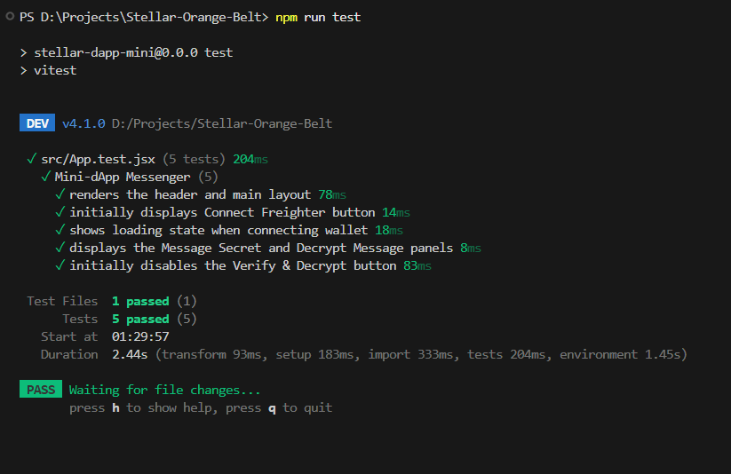

# DeFi Crowdfund - Soroban Smart Contract dApp 🚀

A secure, decentralised crowdfunding application leveraging the Stellar (Soroban) Testnet. This dApp allows creators to initialize funding campaigns, backers to pledge native Stellar tokens securely, and creators to claim funds once their target is met—all managed safely on-chain via a Rust-based Soroban smart contract.

## 🌟 Live Demo & Video
- **Live Demo:** [https://steller-orange-belt.vercel.app/](#)
- **Demo Video:** [https://drive.google.com/file/d/11LNZ7mTTjJbnsj5eN9rLuvLF3J503DUE/view?usp=sharing](#)

---

## 📋 Deployed Contract

| Field | Value |
|-------|-------|
| **Network** | Stellar Testnet |
| **Contract Address** | `CCP4Z5BZG3VCWWGNIDRPFJK4CMFHXJDPKAGOVO4RF62QN7L4R7ZFJATM` |
| **View on Explorer** | [stellar.expert/explorer/testnet/contract/CCP4Z5BZG3VCWWGNIDRPFJK4CMFHXJDPKAGOVO4RF62QN7L4R7ZFJATM](https://stellar.expert/explorer/testnet/contract/CCP4Z5BZG3VCWWGNIDRPFJK4CMFHXJDPKAGOVO4RF62QN7L4R7ZFJATM) |

---

## 🔁 Contract Call Transaction

| Field | Value |
|-------|-------|
| **Transaction Hash** | `7e245c43fe767380230d5d5eee9eac19f6df5e7bb44b551bbae002f278f0edb2` |
| **View on Explorer** | [stellar.expert/explorer/testnet/tx/7e245c43fe767380230d5d5eee9eac19f6df5e7bb44b551bbae002f278f0edb2](https://stellar.expert/explorer/testnet/tx/7e245c43fe767380230d5d5eee9eac19f6df5e7bb44b551bbae002f278f0edb2) |

---

## 🚀 Features
- **Campaign Initialization:** Ability for a creator to set a target funding goal.
- **Backer Pledging:** Seamless integration with Freighter to allow users to pledge testnet tokens securely.
- **Goal-based Claiming:** Creators can only claim the funds once the contract verifies the target amount is reached.
- **Stellar Soroban Interactions:** Fully leverages the `@stellar/stellar-sdk` to invoke the deployed Rust smart contract securely.
- **Glassmorphism UI:** A premium, modern, responsive interface enhancing user experience.

---

## 🧪 Testing Results

The application ensures its fundamental UI and layout operate correctly with standard unit tests via `vitest`. Below is the proof of our passing test suite.

### Screenshot of Passes


```bash
> npx vitest run

 ✓ src/App.test.jsx (5 tests) 317ms
   ✓ Crowdfund dApp (5)
     ✓ renders the header and main layout 82ms
     ✓ initially displays Connect Freighter button 111ms
     ✓ shows loading state when connecting 83ms
     ✓ displays Creator and Backer panels 23ms
     ✓ initially disables the action buttons without wallet connected 18ms

 Test Files  1 passed (1)
      Tests  5 passed (5)
   Start at  09:27:06
   Duration  1.95s
```

---

## 🌐 Tech Stack
- **Frontend:** React + Vite
- **Styling:** Vanilla CSS + Glassmorphism UI
- **Blockchain:** Stellar SDK & Freighter API
- **Smart Contract:** Rust (Soroban)
- **Testing:** Vitest & React Testing Library
